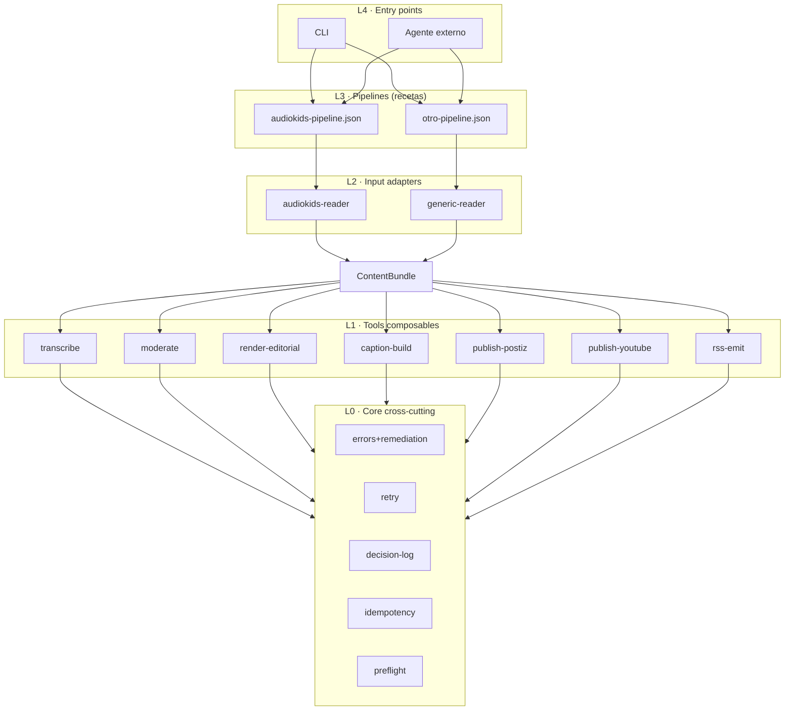
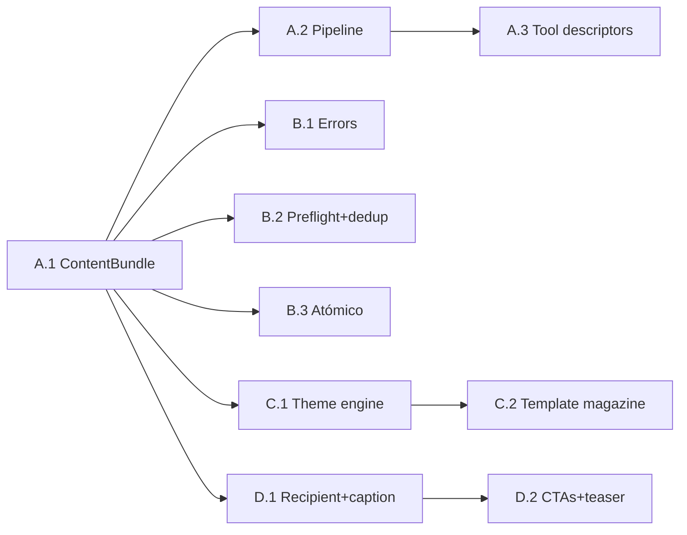

# Sprint 2026-04-22: PostizAgent como Toolkit Abstracto

## Cambio de marco respecto al v1

El sprint inicial trataba PostizAgent como "la herramienta de AudioKids". Tras revisión:

**PostizAgent es un toolkit de herramientas composables para publicación autónoma. AudioKids es el primer consumidor, no el núcleo.**

Esto obliga a refactorizar capas de abstracción ANTES de añadir features editoriales o de voz. Si las añadimos sobre el modelo actual (acoplado a `Story` de AudioKids), todo lo nuevo queda atado y no se reusa para otros casos de uso.

---

## Arquitectura objetivo (capas)



**ContentBundle** es el contrato neutro que cualquier pipeline produce y que todas las tools consumen:

```ts
ContentBundle {
  id: string                     // slug o equivalente único
  kind: 'audio-story' | 'video' | 'image-post' | 'text'
  primaryMedia?: string          // path al asset principal (mp3, mp4, png)
  text: { title?: string, body: string }
  theme?: ThemeHints             // opcional, el engine lo deriva si no viene
  recipient?: Recipient          // opcional, para copy contextualizado
  beats?: Beat[]                 // opcional (AudioKids los genera)
  meta: Record<string, unknown>  // passthrough por pipeline
}
```

Flujo: AudioKids JSON → `audiokids-reader` adapter → ContentBundle → tools. Un pipeline distinto (p. ej. "publicar un post de imagen con cita") inyectaría su propio adapter produciendo el mismo ContentBundle.

---

## 4 épicas, 10 user stories

### Épica A: Core abstraction (desbloquea todo lo demás)

**A.1 · ContentBundle contract + audiokids adapter**
- Refactor `StoryAssets` → `ContentBundle` genérico
- `src/adapters/audiokids.ts` mapea JSON de AudioKids al bundle
- Tools consumen solo `ContentBundle`, nunca `Story` directamente
- AC: pipeline AudioKids actual sigue funcionando end-to-end; test de adapter produce bundle válido.

**A.2 · Tool registry + pipeline declarativo**
- Cada tool implementa `Tool<In, Out> { name, inputSchema, outputSchema, run(ctx), preflight? }`
- Pipeline = JSON con `steps: [toolName, args]` y `platforms: [...]`
- CLI `postiz-agent run --pipeline audiokids.json --id <slug>`
- AC: pipeline mínimo con 2 tools mockeados ejecuta en orden; errores se propagan con contexto.

**A.3 · Tool descriptors para agentes externos**
- Cada tool expone JSON Schema (input/output) consumible por un agente LLM
- `postiz-agent tools list --json` lista herramientas disponibles
- `postiz-agent tools call <name> --input file.json` ejecución aislada (no requiere pipeline)
- AC: un agente externo puede descubrir y llamar `caption-build` sin conocer AudioKids.

---

### Épica B: Self-healing (cross-cutting, aplica a cualquier pipeline)

**B.1 · Error taxonomy + dispatch con memoria**
- `src/core/errors.ts` clasifica cada fallo en `{kind: transient | permanent | needs-config | unknown, remediation: {action, args?, humanHint}, retryable}`
- Clasificadores por origen: Postiz (4xx/5xx/timeout/quota), Whisper (model/audio), HyperFrames (lint/render), ffmpeg, YouTubeCLI
- `dispatch` excluye bundles con 3+ permanent en últimas 72h; backoff 1h/4h/16h para transient
- Flag `--reset-attempts <id>` + comando `decisions --stuck`
- AC: tests con fixtures de errores reales; cuento corrupto no bloquea a los demás.

**B.2 · Preflight + upload dedup + timeout escalado**
- Preflight por tool: duration caps, deps presentes, auth válida, assets existen
- Postiz uploadMedia dedup por SHA256 en `data/upload-cache.json` con TTL 7d
- Timeout de upload escalado: `max(15s, fileSizeBytes / MIN_UPLOAD_KBPS * 1.5)`
- Fallo preflight = `skipped: true` con `reason` claro, NO se renderiza
- AC: cuento >4h a X se salta en <1s; retry de createPost reutiliza media ya subido.

**B.3 · Workspace atómico + verificación de output**
- Render escribe a `output.mp4.tmp`, atomic rename tras verificar
- Verificación: file exists + size > 100KB + `ffprobe duration > 0`
- Capturar stderr HyperFrames en `data/render-logs/<id>-<platform>-<ts>.log` si falla
- AC: output corrupto detectado y marcado permanent; render log accesible vía CLI.

---

### Épica C: Editorial magazine engine (tool `render-editorial`)

**Inspiración declarada**: el formato "Claude Magazine" de Jason Zook (tweet 2044160545540956654). Cada pieza publicada es un spread con tipografía grande, tratamiento editorial distintivo y personalidad visual fuerte. Principio rector: **"no small fonts anywhere"**. Cada bundle renderiza un spread cuya identidad visual depende del contenido, no de un template fijo.

**C.1 · Theme engine (paletas + tipografías + treatments)**
- `hyperframes/themes/palettes.json` con ~20 paletas curadas (forest-rain, midnight-lab, coral-reef, autumn-library, terminal-green, rose-alert, parchment...)
- `hyperframes/themes/fonts.json` con 6-8 pairings display+body, Google Fonts descargadas a `hyperframes/assets/fonts/` (sin dependencia runtime). Base: Fraunces + Inter (ya en uso).
- `hyperframes/themes/treatments.json` con **12 tratamientos editoriales** organizados en 4 familias (editorial, infantil, épica, tech/naturaleza). Catálogo completo en `TREATMENTS.md`:
  - **Editorial**: `hero-display`, `midnight`, `rose-stamp`, `academic-dropcap`, `big-stat`
  - **Infantil**: `storybook-pop`, `crayon-doodle`, `bubble-pastel`
  - **Épica**: `medieval-manuscript`, `epic-cinematic`, `mythic-scroll`
  - **Tech**: `terminal-crt`
- Mapping `mood → candidatos` (ver TREATMENTS.md) para cuando no hay override explícito
- `resolveTheme(bundle)` con prioridad: explicit en metadata → mood-candidatos seleccionados por `hash(bundle.id)` → fallback `hero-display`
- AC: mismo bundle con 3 treatments distintos produce 3 outputs claramente diferenciados; resolución determinista por id; fuentes cargadas local sin red.

**C.2 · Template parametrizable magazine**
- Refactor `fantasia.mjs` → `editorial.mjs` genérico que recibe `{palette, fonts, treatment, layoutHints}`
- CSS con variables raíz: `--bg, --ink, --accent, --muted, --font-display, --font-body, --font-mono`
- Cada treatment define su propio markup + animaciones GSAP (drop cap, stamp rotativo, cursor parpadeante en terminal, reveal del big-stat final, etc.)
- Part ribbon multi-part IG coherente con treatment activo (no parche pegado)
- "No small fonts" como invariante: tamaño mínimo de cualquier texto visible >=32px en 1080p, >=24px en 9:16
- AC: `npx hyperframes lint` pasa en los 12 treatments; snapshot regression test por treatment × aspect ratio (1:1, 9:16, 16:9) = 36 snapshots; linter falla si cualquier texto renderiza <mínimo configurado.
- Entregable auxiliar: `postiz-agent preview gallery --bundle <id>` genera `data/preview-gallery.html` con el bundle renderizado en los 12 treatments (útil para QA visual).

---

### Épica D: Voz contextual (tool `caption-build`)

**D.1 · Recipient + caption builder por plataforma**
- `recipient: {name, age, interests?, relationship?, shareConsent: 'public' | 'first-name-only' | 'anonymous'}` en ContentBundle
- Builders puros por plataforma con tono y formato propios:
  - IG: cálido, emoji moderado, teaser de 2 frases, CTA, hashtags
  - TikTok: directo, <150 chars preferible, CTA corto
  - X: conciso, <280 chars, una línea + CTA
  - YouTube description: largo, metadata completa
- Respeta `shareConsent` en todos los outputs
- Validación de longitud por plataforma antes de entregar a publisher
- AC: tests por plataforma de longitud, inclusión de nombre según consent, presencia de CTA; fallback a caption genérico si `recipient` ausente.

**D.2 · CTAs y teaser**
- `src/copy/ctas.json`: 5-8 variantes por plataforma + tono
- Selección determinista: `hash(bundleId + platform) % variants.length`
- Teaser: primeras 2 frases del `text.body`, cap 180 chars, corta por palabra completa, filtra blocklist
- Log del `ctaVariant` en decision log para analytics posterior
- AC: mismo id siempre genera mismo CTA; teaser no rompe palabras ni incluye términos bloqueados.

---

## Dependencias y orden



**Semana 1**: A.1 (crítico, bloquea todo) luego A.2. Paralelizable B.1.
**Semana 2**: A.3, B.2, B.3, C.1, D.1 en paralelo (archivos distintos).
**Semana 3**: C.2, D.2 + integración end-to-end.

---

## Qué NO entra en este sprint

- Construir un segundo pipeline real distinto a AudioKids (solo dejamos puertas abiertas)
- Engagement analytics ingestion desde YouTubeCLI
- UI web
- Multi-idioma en captions (asume español)
- Authoring manual de moods hardcodeados (el theme engine los hace obsoletos)

---

## Definition of Done

- [ ] `pnpm test` verde; cobertura de tools nuevas >=80%
- [ ] Pipeline AudioKids end-to-end sin regresiones
- [ ] `postiz-agent tools list` expone >=7 herramientas con JSON Schema
- [ ] Un agente externo puede llamar una tool aislada (p. ej. `caption-build`) y recibir output válido
- [ ] 3 bundles reales publicados a X/TikTok/IG con 3 themes magazine distintos y captions con recipient
- [ ] Dispatch corre 72h en background: errores transient se recuperan sin intervención, decision log lo demuestra
- [ ] README y SKILL.md reflejan el nuevo modelo de capas
