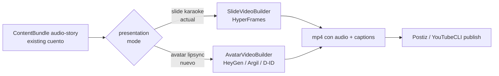

# Presentation modes (roadmap)

Today the toolkit produces ONE kind of video for audio-story bundles: a slide-based composition with karaoke captions, narrator voice as audio, theme-driven visuals (12 treatments × 29 palettes × 10 font pairings). The product is "a book page reading itself".

The next presentation mode worth building: **same cuento, narrated by an AI avatar with lipsync to the existing audio**. The content is identical (the cuento we already render), the wrapper changes from text-on-screen to a person on screen. TikTok and Instagram reward presence (a face) more than text, the same content plausibly converts much better in those feeds.

This doc captures the design decision so the path is dibujado when we pull the trigger. No code change yet.

## What this is, what this is NOT

What this IS:
- A second renderer that takes the same `ContentBundle` (audio-story) the slide renderer takes today
- Input: existing cuento audio (`bundle.primaryMedia`), existing whisper transcript, a persona avatar reference (image or LoRA)
- Output: an MP4 with the persona's face on screen, lipsynced to the cuento audio, optional captions overlaid

What this is NOT:
- A subscriber memory system (no `brain.md`, no per-fan state)
- A reply / DM bot (no inbox loop)
- A multi-persona orchestrator that fans out the same content (one persona at a time is enough)
- An attempt to disguise the avatar as a real human (TikTok / IG require AI-generated content disclosure, comply with that)

The product layer is "the cuento, presented better for short-form video", not "an AI agent that pretends to be someone".

## Tool landscape, 2026

Different tools solve different problems. The user has mentioned Higgsfield and Flux as candidates; both are useful but neither is a lipsync-to-audio tool, so it's worth being precise about what fits where.

| Tool | What it actually does | Fits for "avatar reading our cuento"? |
|------|----------------------|--------------------------------------|
| **HeyGen Avatar IV** | text or audio → lipsynced talking-head video, BYO photo or BYO custom avatar | ✅ Best in class for lipsync quality. Audio-input mode is exactly our shape. |
| **Argil** | BYO LoRA + audio → talking-head video, UGC-positioned | ✅ Similar shape, cheaper, more "creator" feel |
| **HeyGen Talking Photo** | static photo + audio → animated talking version | ✅ Cheapest path, lower fidelity than Avatar IV |
| **D-ID** | photo + audio → talking video | ✅ Cheap pay-per-minute, lipsync accuracy below HeyGen |
| **Captions AI** | mobile app, talking-head + B-roll, TikTok-native | ✅ If we want the "TikTok creator" vibe baked in |
| **Synthesia** | text → corporate avatar video | ⚠️ Corporate-feeling, mismatch with "narradora cálida" tone |
| **Sync Labs** | photo + audio → lipsync, API-first | ✅ Programmatic, cheap |
| **Higgsfield** | text → short cinematic video clips | ❌ NOT lipsync. Generates novel scenes from prompts. Useful for B-roll between narration, not for avatar reading. |
| **Flux** | text → image | ❌ Image-only, no animation. Useful for generating the avatar reference photo or a cover, not the video itself. |
| **Runway Gen-4 / Pika / Sora** | text or image → video clip | ❌ Same as Higgsfield: no lipsync. B-roll candidates. |

For the "avatar reading the cuento" mode, the provider shortlist is **HeyGen Avatar IV** (premium quality), **Argil** (UGC fit + cheaper), or **D-ID** (cheap baseline). Pick one and move.

Flux is only useful here as the generator of the avatar reference photo (one-time, before the LoRA / before HeyGen ingests the avatar). Higgsfield is only useful if we later want B-roll cuts mixed into the talking-head output, which is a separate feature.

## Architecture: where it plugs in

Decision is: where does the `presentation` hint come from? Three options, pick one when implementing:

1. **Per-tenant default**: `tenants/<slug>/config.json` adds `"presentation": "avatar"` so every cuento that tenant publishes uses avatar mode. Simplest. Good for "this brand is always the avatar persona".
2. **Per-platform default**: avatar for TikTok / IG, slide for X / YouTube / RSS. Good when one persona-style fits short-form and another fits long-form.
3. **Per-bundle override**: `bundle.presentation = 'avatar'` set by the adapter or by a CLI flag. Most flexible, most state to track.

Recommend **per-platform default per tenant** as the right blend: the tenant config says "TikTok = avatar, YouTube = slide" once, and every cuento follows.

## Spike plan

When ready, the minimum end-to-end spike to validate the avatar mode on ONE platform is 2-3 working days:

1. **Pick the provider**. Open an account, get an API key, generate one persona avatar (one upload of a generated face from Flux or a photo, or train a LoRA if going Argil).
2. **Add `presentation` field** (optional) to `tenants/<slug>/config.json` and to the orchestrator's `PublishContext`. Default behaviour unchanged when absent.
3. **Implement `AvatarVideoBuilder`** in `src/media/avatar-video.ts`. Input: bundle audio + transcript + persona avatar reference. Output: MP4. Uses provider's API: upload audio, trigger render, poll status, download MP4, run through `render-output.ts` for atomic finalisation.
4. **Switch in `resolveMediaForPlatform`** on `presentation === 'avatar'`. No interface extraction yet (single second implementation, "rule of three" applies, keep it as a switch).
5. **Publish 5-10 cuentos** over 7 days on the test account. Compare metrics to a parallel cuenta-test on slide-karaoke (7-day retention, follow rate, completion rate).
6. **Decide**. If avatar wins clearly, keep it. If not, the switch and the new file are easy to delete; tests still cover slide-karaoke as before.

Total operator side: provider account ($24-49/mo HeyGen / Argil), one cuenta-test on TikTok, one persona avatar reference (a Flux generation is fine, doesn't need to be photorealistic LoRA for the spike).

Total dev side: ~2-3 working days. One new file, ~2 modified files, ~50 lines of new test coverage for the builder mock.

## What is NOT in scope

- Inbox / DM responses
- Subscriber memory (`brain.md`-style state)
- Multi-persona orchestration (one persona at a time, no fan-out)
- B-roll mosaics / generative video clips (Higgsfield, Pika, Runway): a separate feature for a separate use case, not on this roadmap
- Avatar consistency engineering (LoRA fine-tuning workflows, locked seeds, distinguishing marks): only relevant if we go past the spike and need the persona to feel "always the same" across hundreds of videos, ship the spike first
