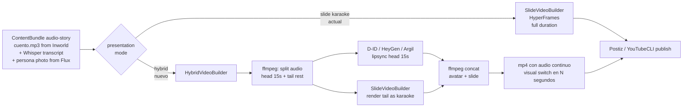

# Presentation modes (roadmap)

Today the toolkit produces ONE kind of video for audio-story bundles: a slide-based composition with karaoke captions, narrator voice as audio, theme-driven visuals (12 treatments × 29 palettes × 10 font pairings). The product is "a book page reading itself".

The next presentation mode worth building: **hybrid intro+continuation**. The first 10-20 seconds show a persona narrator (AI avatar lipsynced to the cuento audio); the remainder transitions to the existing slide-karaoke format. Same cuento, same audio, just a face hook on top.

This is better than full-length avatar for three concrete reasons:
- **Cost**: lipsync providers charge per second of output. A 5-minute cuento as full avatar costs $1-3+. The same cuento with a 15-second avatar intro costs $0.05-0.20.
- **Retention**: TikTok / IG algorithms reward attention in the first 3 seconds. A face on screen converts better than text in that window. After 15 seconds the audience is already invested; the slide format keeps them following the story without paying for talking-head every frame.
- **Readability for kids**: the slide karaoke is genuinely useful for early readers following along. Full avatar removes that. Hybrid keeps both.

This doc captures the design decision so the path is dibujado when we pull the trigger. No code change yet.

## Inputs we already produce

- **Audio**: Inworld TTS generates the narrator voice already, the `cuento.mp3` is part of every AudioKids bundle. Nothing new to build on the audio side, the lipsync provider receives this file as-is.
- **Transcript**: Whisper word-level timestamps already exist for every audio-story bundle.
- **Cover / persona reference**: a Flux-generated photo of the narrator persona (one-time, reused across all videos). Generated on day one of the spike, then frozen.

## What this is, what this is NOT

What this IS:
- A renderer that produces an mp4 of shape `[0..N seconds avatar lipsync] + [N..end seconds slide karaoke]` over the existing cuento audio
- Provider does the lipsync portion only (cheap, 10-30 seconds of output per cuento)
- Slide karaoke renders the remainder using the existing HyperFrames pipeline
- ffmpeg concatenates the two video tracks over the single continuous audio

What this is NOT:
- A subscriber memory system (no `brain.md`, no per-fan state)
- A reply / DM bot (no inbox loop)
- A multi-persona orchestrator that fans out the same content (one persona at a time is enough)
- A full-avatar mode (the hybrid is cheaper and converts at least as well)
- An attempt to disguise the avatar as a real human (TikTok / IG require AI-generated content disclosure, comply with that)

The product layer is "the cuento, presented with a face hook for the first few seconds", not "an AI agent that replaces the cuento".

## Tool landscape, 2026

The cost calculus shifts when we only need 10-30 seconds of avatar per video instead of full duration. Pay-per-second providers become very cheap, and the consistency-engineering tools (custom avatar / LoRA) only matter once the spike validates and we want to scale.

| Tool | What it actually does | Fit for hybrid intro |
|------|----------------------|---------------------|
| **D-ID** | photo + audio → talking video, pay-per-second | ✅ Best for the spike. ~$0.05-0.20 per 15s clip. Quality below HeyGen but adequate when the avatar only appears 15s. |
| **HeyGen Talking Photo** | photo + audio → animated talking version | ✅ Slightly better quality than D-ID, similar pricing. |
| **HeyGen Avatar IV** | audio + custom avatar → lipsynced video | ✅ Premium quality. Custom avatar requires upload of multiple training photos; locks consistency for production scaling later. |
| **Argil** | BYO LoRA + audio → talking-head video | ✅ UGC-positioned, ~$39/mo. LoRA training is several hours up front, then very cheap and very consistent per video. |
| **Sync Labs** | photo + audio → lipsync, API-first | ✅ Programmatic, cheap, headless. Worth a look if D-ID's API ergonomics are clunky. |
| **Captions AI** | mobile app, talking-head + B-roll, TikTok-native | ⚠️ Mobile-first, doesn't expose a clean API for headless renders. Skip for this pipeline. |
| **Synthesia** | text → corporate avatar video | ⚠️ Corporate-feeling, mismatch with the warm-narrator tone. |
| **Higgsfield** | text → short cinematic video clips | ❌ NOT lipsync. Generates novel scenes from prompts. Useful only for B-roll between narration, separate feature. |
| **Flux** | text → image | ⚠️ Useful upstream as the persona-photo generator (one-time), then frozen. Not the renderer. |
| **Runway Gen-4 / Pika / Sora** | text or image → video clip | ❌ Same as Higgsfield: no lipsync to a given audio. B-roll candidates only. |

Recommendation for the spike: **D-ID** (cheapest pay-per-second, fits perfectly when only 15s per cuento) or **HeyGen Talking Photo**. If the spike validates and we want to lock the persona for production scale (hundreds of videos with the same face), upgrade to **HeyGen Custom Avatar** or **Argil LoRA** at that point. Don't pay for that consistency layer up front.

Flux's role: generate ONE persona photo on day one. Frozen forever. Even if we later upgrade to a custom avatar, that initial photo can be the seed for the LoRA training set.

## Architecture: where it plugs in

The hybrid builder reuses the existing `SlideVideoBuilder` for the tail; the only new piece is the lipsync call + the ffmpeg-concat step. The audio passed to the lipsync provider is just the first N seconds of `cuento.mp3`; the audio in the final mp4 is the original full `cuento.mp3` so there are no audio cuts at the visual transition point.

Decision is: where does the `presentation` hint come from? Three options:

1. **Per-tenant default**: `tenants/<slug>/config.json` adds `"presentation": "hybrid"` so every cuento that tenant publishes uses the hook+slide mode. Simplest.
2. **Per-platform default**: hybrid for TikTok / IG, slide for X / YouTube / RSS. The hybrid hook only matters where the algorithm rewards attention spikes; YouTube watchers self-select for longer content.
3. **Per-bundle override**: `bundle.presentation = 'hybrid'` set by the adapter or by a CLI flag. Most flexible, most state to track.

Recommend **per-platform default per tenant** as the right blend: the tenant config says "TikTok=hybrid, IG=hybrid, YouTube=slide, X=slide" once, every cuento follows.

## Spike plan

End-to-end spike to validate the hybrid mode on ONE platform, 2-3 working days:

1. **Generate the persona photo** with Flux (or any other text-to-image). One single image of the narrator. Pin in `assets/persona-narradora.png` so it survives reruns.
2. **Open a D-ID account** (cheapest spike option, ~$5-10 to test 50 videos). Get the API key.
3. **Add `presentation` field** (optional) to `tenants/<slug>/config.json` and to the orchestrator's `PublishContext`. Default behaviour unchanged when absent. Add `hybridIntroSec` (default 15) so the duration is configurable per tenant.
4. **Implement `HybridVideoBuilder`** in `src/media/hybrid-video.ts`:
   - Trim the audio to first N seconds with ffmpeg
   - Call D-ID with persona photo + trimmed audio, poll, download `avatar.mp4`
   - Reuse existing `SlideVideoBuilder` to render the tail as karaoke
   - Concatenate the two with ffmpeg over the original full audio
   - Run through `render-output.ts` for atomic finalisation
5. **Switch in `resolveMediaForPlatform`** on `presentation === 'hybrid'`. No interface extraction yet, single second implementation, "rule of three" applies, keep it as a switch.
6. **Publish 5-10 cuentos** over 7 days on the test TikTok account. Compare metrics to a parallel cuenta-test on slide-karaoke (3-second retention, 7-day retention, follow rate, completion rate).
7. **Decide**. If hybrid wins clearly on 3-second retention, keep it and roll out. If not, the switch and the new file are easy to delete, tests still cover slide-karaoke as before.

Total operator side: ~$15 in API spend, one Flux generation (free with most accounts), one cuenta-test on TikTok.

Total dev side: ~2-3 working days. One new file (`hybrid-video.ts`), ~2 modified files, ~50 lines of new test coverage with a mock D-ID client.

## What is NOT in scope

- Inbox / DM responses
- Subscriber memory (`brain.md`-style state)
- Multi-persona orchestration (one persona at a time, no fan-out)
- B-roll mosaics / generative video clips (Higgsfield, Pika, Runway): a separate feature for a separate use case, not on this roadmap
- Avatar consistency engineering (LoRA fine-tuning workflows, locked seeds, distinguishing marks): only relevant if we go past the spike and need the persona to feel "always the same" across hundreds of videos, ship the spike first
